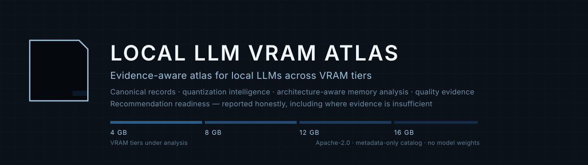

<div align="center">


# أطلس النماذج اللغوية المحلية لذاكرة VRAM

**أطلس موثَّق بالأدلة للنماذج اللغوية المحلية عبر فئات ذاكرة 4 و8 و12 و16 غيغابايت**

[](LICENSE)
[](pyproject.toml)
[](catalog/manifest.json)
[](docs/ar/workflows/recommendation-readiness.md)

**[English](README.md)** · [العربية](README_AR.md)

</div>

<div align="center">



</div>

---

## ما هذا المشروع

«أطلس النماذج اللغوية المحلية لذاكرة VRAM» نظامُ مرجعٍ **واعٍ بالأدلة** يعتمد على
**البيانات الوصفية وحدها**، للنماذج اللغوية المحلية والمفتوحة الأوزان، منظَّم حول
السؤال الذي يحدّد فعليًا ما إذا كان النموذج صالحًا للاستخدام على عتاد المستهلك:

> أيّ نموذج يمكنني تشغيله على بطاقة بذاكرة 4 أو8 أو12 أو16 غيغابايت، وما مقدار
> الثقة الممكنة في تلك الإجابة؟

يجيب الأطلس بـ**سجلات معيارية**، و**أدلة معلَنة**، و**حالات جاهزية صريحة**. وهو لا
ينشر قائمة ترتيب، ولا يخبرك بأفضل نموذج. وحيث لا تدعم الأدلة إجابة، يُبلّغ عن
غياب الإجابة، ويسمّي الدليل الناقص.

**الأطلس حاليًا مستودع منتقى خاص.** البيانات حقيقية، والأدوات حقيقية، والتغطية
ناقصة. وكلتا الحقيقتين مُعلَنة بوضوح أدناه بدلًا من التسويق لهما.

## لماذا لا يكفي عدد المعاملات

عدد المعاملات مثل «8B» لا يحدّد وحده مدى ملاءمة النموذج لميزانية ذاكرة معيّنة.
فالنموذجان من فئة «8B» بتكميمين مختلفين قد يفترقان عدة غيغابايتات أثناء التشغيل،
لأن الاستهلاك الفعلي يعتمد على:

- صيغة التكميم والبِتات الفعلية لكل وزن؛
- بيئة التشغيل والواجهة الخلفية، وعبء الذاكرة الرسومية فيهما؛
- صيغة ذاكرة KV وطول السياق وعدد التسلسلات؛
- حجم الدفعة واستراتيجية التفريغ؛
- المكوّنات متعددة الوسائط ومدارس الرؤية.

وحجم الملف ليس استهلاك الذاكرة الرسومية أيضًا. فكون ملف أوزان أصغر من ذاكرة
البطاقة **لا يثبت** أن النموذج يعمل عليها. وتفصل المخططات في هذا المستودع
`weight_file_size_gib` عن `measured_vram_gib` و`minimum_vram_gib`
و`recommended_vram_gib`، ولا يُسمح لأي أداة فيه باستنتاج «يناسب» من حجم الملف
وحده.

## النطاق الحالي والموضع الصادق

هذه هي حالة البيانات الحالية، مُعلَنة دون تجميل.

| القياس | القيمة |
|---|---|
| إصدارات النماذج المفهرسة | 34 |
| متغيّرات المُخرجات المكمَّمة المفهرسة | 201 |
| مواصفات JSON Schema | 18 |
| سجلات الأدلة | 109 |
| نتائج تقييم المقاييس | 21 |
| قياسات ذاكرة خارجية | 2 |
| سجلات الاحتفاظ عند التكميم | 8 |
| العروض ثنائية اللغة المولَّدة | 28 |
| الاختبارات دون اتصال | 687 ناجحًا، 8 متخطّاة |
| **التوصيات الصارمة عند 4 / 8 / 12 / 16 غيغابايت** | **صفر** |

والجاهزية عبر المرشَّحين التسعة عشر في مجموعة التوصيات الأساسية:

| حالة الجاهزية | العدد |
|---|---|
| `STRICT_READY` | 0 |
| `CANDIDATE_READY` | 6 |
| `CATALOG_ONLY` | 12 |
| `BLOCKED` | 1 |

ونطاقات الأدلة غير المحلولة:

| النطاق | عدد النماذج المتأثرة |
|---|---|
| أدلة الجودة العربية | 34 من 34 |
| أدلة الملاءمة للذاكرة الرسومية | 34 من 34 |
| أدلة الجودة المستقلة متعددة المصادر | 34 من 34 |
| أدلة الاحتفاظ عند التكميم | 8 |
| البنية المحلولة | 10 |

### لماذا صفر توصيات صارمة

لأن التوصية الصارمة تتطلب أدلة غير موجودة حتى الآن لأي مُخرَج في الكتالوج.
والمُعيقان الحاسمان موثّقان لا مجهولان:

1. **لا حدَّ منشور لعبء وقت التشغيل.** تُبلّغ بيئات التشغيل عن تخصيصات الذاكرة
   الرسومية وقت التشغيل لواجهة خلفية ونموذج محدَّدين، لكنها لا تنشر حدًّا أقصى
   للعبء الساكن أو الديناميكي. ولذلك يُبقي الأطلس الحدّ الأعلى للذاكرة غائبًا بدل
   استبدال ثابت مخترَع، فتبقى حالة الفئة `insufficient_evidence` بدل أن تتحول إلى
   ملاءمة مُخترعة.
2. **لا نتائج جودة مستقلة متعددة المصادر.** بحث محدود ومجهول الهوية وللقراءة فقط
   في أسطح المقاييس المستقلة لم يجد نتائج منشورة إلا في صفحات تُبنى في المتصفح،
   أو في مجموعات بيانات لا ينزّلها هذا النظام. ولم تُتجاوز أي حماية، ولم يُستخدم أي
   نقطة خاصة.

وهذا هو السلوك المقصود. وعدٌ غير صفري مُختلق أسوأ من صفر صادق.

## المزايا الأساسية

- **سجلات نماذج معيارية** — بصيغة JSON مُحقَّقة ضد مخططات، تحمل النسب والترخيص
  وتصنيف الانفتاح وحالة التحقق لكل حقل.
- **هوية مُخرَج دقيقة** — السجل يخصّ `artifact_set_id` واحدًا عند مراجَعة واحدة، لا
  «نموذجًا» بالمفهوم المجرّد. وتكميمان مختلفان للنموذج نفسه مُخرَجان مختلفان.
- **ذكاء التكميم** — سجل مُصدَّر يضم 46 مدخل تكميم مع استدلال البتات لكل وزن،
  إضافةً إلى تجميع المُخرجات من الملفات المقسَّمة والمكوّنات المرافقة.
- **تحليل ذاكرة واعٍ بالبنية** — بايتات الأوزان، وبايتات ذاكرة KV، والعبء الساكن
  والديناميكي، و**مدى** مع حالة دليل صريحة بدل رقم واحد مُختلق.
- **تصنيف فئات الذاكرة الرسومية** — تصنيف بالمدى مقابل 4 و8 و12 و16 غيغابايت،
  تكون فيه `insufficient_evidence` نتيجةً أساسية.
- **أدلة جودة ذات نسب** — ترتبط نتائج التقييم بالمُخرَج الذي قيس عليه بدقّة، بهوية
  أدوات كاملة، ولا ترث درجة النموذج الأساسي أبدًا.
- **الاحتفاظ عند التكميم** — فروق مقارَنة بين الأساسي والمكمَّم عند تطابق كل مفاتيح
  الإعداد القابل للمقارنة، ولا مقارنة إطلاقًا عند اختلاف أي مفتاح.
- **جاهزية التوصيات** — تسع بوابات صارمة معلَنة تنتج أربع حالات جاهزية لا تُدمج
  ولا يُمنح فيها أي تنازل ولا تُضبط يدويًا.
- **إخراج ثنائي اللغة** — كل عرض مولَّد يُعرض بالإنجليزية والعربية من حمولة قانونية
  واحدة في العملية نفسها.
- **استحواذ محدود وبلا بيانات اعتماد** — قراءة عامة مجهولة فقط، وطلبا GET وHEAD
  فقط، وسقوف معلَنة للطلبات والبايتات، ورفض روابط الأوزان قبل إجراء الطلب، وعدم
  اتباع إعادة التوجيه.

## ما لا يدّعيه الأطلس

- **لا يدّعي** وجود أفضل نموذج متحقَّق منه لأي فئة ذاكرة. وهو يُبلّغ حاليًا عن صفر
  توصيات صارمة عند كل فئة.
- **لا يدّعي** اكتمال تغطية النماذج. فالكتالوج مجموعة منتقاة مبنية عبر مسارات
  اكتشاف مضبوطة، لا حصر شامل.
- **لا يدّعي** يقينًا تشغيليًا. فهو يُبلّغ عن حالات الأدلة ويسمّي ما هو ناقص.
- **لا ينقل** درجة النموذج الأساسي إلى مشتق مكمَّم، ولا درجة النموذج الأب إلى متغيّر
  معدَّل المحاذاة.
- **لا يعتبر** التنزيلات والإعجابات وحالة الرواج مؤشرات جودة.
- **لا يستنتج** حالة «مفتوح المصدر» من إمكانية تنزيل الأوزان.
- **لا يستضيف** أوزان النماذج. فهو فهرس، لا مستودع نماذج.
- **لا يدّعي** خصائص أمنية تتجاوز ما يقيسه، ولا يدّعي 상태ًا خاليًا من الثغرات.

## مستويات الدليل

يحمل كل ادعاء مهم حالة تحقق، ولا تُرقّى حالة أضعف إلى أقوى دون رصد جديد.

| الحالة | المعنى |
|---|---|
| `unknown` | غير معروف، ويجب ألا يُخترَع. |
| `unverified` | مسجَّل لكنه لم يُفحص بعد. |
| `estimated` | ناتج عن منهجية موثَّقة. |
| `publisher_claim` | مصرَّح به من ناشر النموذج؛ ليس حقيقة مستقلة. |
| `quantizer_claim` | مصرَّح به من مُنتج التكميم؛ ليس حقيقة مستقلة. |
| `independently_verified` | أكّدته جهة مستقلة قابلة لإعادة الإنتاج. |
| `atlas_verified` | قِيست داخل الأطلس تحت ظروف موثَّقة. |

ولا تُحوَّل ادعاءات الناشرين إلى حقائق مستقلة أبدًا.

## دلالات التوصيات

جاهزية التوصية فئوية، ولا تُدمج الحالات الأربع أبدًا.

| الحالة | المعنى |
|---|---|
| `STRICT_READY` | كل بوابة صارمة معلَنة مستوفاة بدليل محفوظ قابل للتنقّل. |
| `CANDIDATE_READY` | دليل جوهري ومحتوى مفيد، مع بقاء بوابة صارمة أو أكثر مفتوحة، وذكر كل بوابة ناقصة. |
| `CATALOG_ONLY` | محتوى فهرسة مشروع دون أدلة توصية كافية. |
| `BLOCKED` | مشكلة حرجة في الهوية أو الترخيص أو بيئة التشغيل أو النسب أو سلامة الأدلة. |

بوابةٌ واحدة ناقصة تخفض الحالة، ولا ترفعها أبدًا. ولا يوجد تجاوز يدوي، ولا تنازل
بناءً على الشعبية أو الحجم أو عدد المعاملات أو العلامة التجارية أو الحداثة أو الانتشار.

## التثبيت

الأطلس مكتبة وأداة سطر أوامر بلغة بايثون، ويتطلب بايثون 3.10 أو أحدث.

```bash
git clone <repository-url>
cd Local-LLM-VRAM-Atlas

python -m venv .venv
# Windows:      .venv\Scripts\activate
# Linux/macOS:  source .venv/bin/activate

pip install -e ".[dev]"
```

اعتماديات التشغيل هي `jsonschema` و`huggingface_hub`. وتضيف التطوير `pytest` و`ruff`.

والمستودع صالح للاستخدام مباشرةً من نسخة محلية دون تثبيت:

```bash
$env:PYTHONPATH = 'src'          # Windows PowerShell
export PYTHONPATH=src            # Linux / macOS
```

## البدء السريع

تحقّق من مجموعة البيانات والأدوات:

```bash
python -m atlas.cli.main sources --check
python -m atlas.cli.main validate --schema model \
  --record catalog/models/openbmb-minicpm5-2b.json
python -m atlas.cli.main catalog stats
```

اقرأ وضع التوصيات الحالي:

```bash
python -m atlas.cli.main recommend tier --tier 8
```

```
tier_gb: 8
Strict recommendations: 0
Promising candidates: 0
Fit candidates — quality evidence incomplete: 0
Insufficient evidence: 34
Reason: no model satisfies every declared recommendation domain for this tier.
```

افحص فجوات الأدلة، ليكون الصفر أعلاه مفهومًا لا غامضًا:

```bash
python -m atlas.cli.main quality gaps
```

## استخدام سطر الأوامر

كل أمر مُعدِّل **يعمل في وضع تجريبي افتراضيًا**، والكتابة تتطلب `--apply` صريحًا.

```bash
# فحص البيانات الوصفية العامة دون كتابة أي شيء
python -m atlas.cli.main inspect openbmb/MiniCPM5-2B

# التحقق ضد المخططات
python -m atlas.cli.main validate --schema model \
  --record catalog/models/qwen-qwen3-8b.json

# استعلامات الكتالوج
python -m atlas.cli.main catalog stats
python -m atlas.cli.main catalog list --vram-tier 8
python -m atlas.cli.main catalog show qwen-qwen3-8b
python -m atlas.cli.main catalog views

# سجل التكميم
python -m atlas.cli.main quantization list --family q4

# حل البنية من ملف إعداد
python -m atlas.cli.main arch resolve --config path/to/config.json

# جاهزية التوصيات
python -m atlas.cli.main recommend tier --tier 12
python -m atlas.cli.main recommend model qwen-qwen3-8b --tier 8

# أدلة الجودة
python -m atlas.cli.main quality sources --check
python -m atlas.cli.main quality gaps
python -m atlas.cli.main quality show qwen-qwen3-8b
python -m atlas.cli.main retention show qwen-qwen3-8b

# جاهزية النشر
python -m atlas.cli.main closure readiness
python -m atlas.cli.main closure vram
python -m atlas.cli.main closure gap-matrix
```

وتستخدم واجهة التحديث عقدَ رموز خروج موثَّقًا، يكون فيه الرمز `10` يعني «عُثر على
تغييرات» وهو **إشارة نجاح** لا خطأ. انظر
[التحديث واستيعاب الأدلة](docs/ar/workflows/refresh-and-evidence-ingestion.md).

## بنية المستودع

```text
Local-LLM-VRAM-Atlas/
├── README.md                 هذه الوثيقة (بالإنجليزية)
├── README_AR.md              المقابل العربي
├── CHANGELOG.md              سجل التغييرات المنتقى
├── LICENSE                   رخصة Apache 2.0
├── NOTICE                    نسب العمل وحدود الأطراف الثالثة
├── pyproject.toml            بيانات الحزمة
├── .gitignore                نظافة المستودع
│
├── src/atlas/                التنفيذ، 113 وحدة
│   ├── intake/               محوّلات المصدر، والتطبيع، والنسب، والحُرّاس
│   ├── archinfo/             حل البنية ومخططات الطبقات
│   ├── quant/                سجل التكميم مُصدَّر الإصدار
│   ├── artifact/             تجميع مجموعات المُخرجات
│   ├── memory/               حساب الأوزان وذاكرة KV والعبء
│   ├── vram/                 تصنيف الفئات
│   ├── quality/              استيعاب الأدلة والملفات والاحتفاظ والجاهزية
│   ├── catalog/              تجميع الكتالوج القانوني وتوليد العروض
│   ├── refresh/              البصمات والتخطيط والتطبيق الذرّي
│   ├── closure/              المجموعة الأساسية وإغلاق الأدلة وجاهزية النشر
│   ├── external/             استحواذ خارجي محدود
│   ├── security/             فرض سياسة الشبكة
│   ├── validation/           التحقق ضد المخططات
│   └── cli/                  سطح الأوامر، تجريبي افتراضيًا
│
├── schemas/                  18 مواصفة JSON Schema Draft 2020-12
│
├── catalog/                  مجموعة البيانات القانونية
│   ├── models/               34 سجل نموذج
│   ├── artifacts/            201 سجل مُخرَج
│   ├── evidence/             109 مرفق دليل
│   ├── benchmarks/           21 نتيجة تقييم
│   ├── quality/              الملفات والاحتفاظ والفجوات
│   ├── closure/              المجموعة الأساسية وأدلة الذاكرة والجاهزية
│   └── views/                28 عرضًا مولَّدًا ثنائي اللغة
│
├── docs/
│   ├── en/                   التوثيق الإنجليزي
│   │   ├── architecture/     معمارية النظام، وتدفّق السجل المعياري
│   │   ├── workflows/        التحديث والتوصيات وتوليد البيانات
│   │   ├── catalog/          نظرة عامة على الكتالوج
│   │   ├── methodology/      المنهجية المنشورة
│   │   ├── governance/       الترخيص والأدلة والأمان والمساهمة
│   │   └── terminology/      المصطلحات
│   ├── ar/                   المقابل العربي، بالهيكل نفسه
│   └── diagrams/             فهرس الأشكال ثنائي اللغة
│
├── assets/branding/          الأيقونة واللافتة وإرشادات العلامة
├── tests/                    687 اختبارًا دون اتصال، ببيانات تركيبية
└── tools/                    أدوات تدقيق النشر اللغوي
```

### من أين تبدأ

| إن أردت أن تفهم | اقرأ |
|---|---|
| كيف يُركَّب النظام | [معمارية النظام](docs/ar/architecture/atlas-system-architecture.md) |
| نموذج البيانات | [تدفّق السجل المعياري](docs/ar/architecture/canonical-record-flow.md) |
| كيف يصير الدليل توصية | [جاهزية التوصيات](docs/ar/workflows/recommendation-readiness.md) |
| كيف يدخل الواقع الخارجي الكتالوج | [التحديث واستيعاب الأدلة](docs/ar/workflows/refresh-and-evidence-ingestion.md) |
| ماذا في مجموعة البيانات | [نظرة عامة على الكتالوج](docs/ar/catalog/catalog-overview.md) |
| كل المخططات | [فهرس الأشكال](docs/diagrams/README_AR.md) |
| المصطلحات | [المسرد](docs/ar/terminology/glossary.md) |

والوثائق التي تنتهي بلاحقة `-phase-NN` هي **وثائق منهجية منشورة** تسجّل المراجعة
التي رُسِّمت فيها المنهجية، وليست تقارير بناء داخلية.

## المعمارية وسير العمل

تسعة مخططات تغطّي النظام ونموذج البيانات وسِيَر العمل وبنية المستودع. وكلها بصيغة
Mermaid مضمَّنة في Markdown، وتُعرض مباشرةً على خادم المستودع. انظر
[فهرس الأشكال](docs/diagrams/README_AR.md).

## التطوير

```bash
python -m pytest -q
python -m ruff check src tests
```

وتعمل مجموعة الاختبارات دون اتصال بالكامل افتراضيًا. والاختبارات التي تتصل بخادم
Hugging Face العام اختيارية عبر وسم `live`:

```bash
python -m pytest -q -m live
```

وتوجد أدوات تدقيق النشر اللغوي في `tools/`:

```bash
python tools/qa_proofread.py --all      # سلامة النص والرموز في اللغتين
python tools/qa_doc_parity.py           # تطابق عناوين الإنجليزية والعربية
python tools/qa_cli_refs.py             # التحقق من عمل كل أمر موثَّق
```

## ملاحظة التوثيق

التوثيق ثنائي اللغة بحكم البناء. تُعرض العروض المولَّدة بالإنجليزية والعربية من حمولة
قانونية واحدة في العملية نفسها، فلا يمكن أن تتباعدا. والوثائق المكتوبة يدويًا تخضع
للقاعدة نفسها عبر اختبار آلي يشترط أن لكل وثيقة إنجليزية مقابلًا عربيًا ببنية عناوين
مطابقة.

## الترخيص

شيفرة الأطلس مرخَّصة بموجب **رخصة Apache 2.0**. انظر [`LICENSE`](LICENSE) و
[`NOTICE`](NOTICE).

وتبقى للنماذج الخارجية تراخيصها الخاصة. ولا يحتوي هذا المستودع **على أي أوزان
نماذج**. يفهرس الأطلس بيانات النماذج الخارجية وأدلتها المنشورة ويحلّلها؛ ولا يعيد
ترخيصها، ولا يعيد توزيعها، ولا ينقل ملكيتها. وتبقى لنتائج المقاييس ووثائق الناشرين
حقوق أصحابها الأصليين.

## إخلاء المسؤولية

هذا المشروع غير تابع لأي ناشر نماذج أو مُنتج تكميم أو جهة صيانة مقاييس أو بيئة
تشغيل مذكورة في الكتالوج، وغير معتمد منها ولا مدعوم برعاياتها، ما لم تُوثَّق هذه
العلاقة صراحةً ويُثبَت دليلها.

## الحالة

هذا المستودع خاص ولم يجر بعد كإطلاق عام. الأدوات والمخططات والكتالوج حقيقية وقابلة
للاستخدام اليوم. وقاعدة الأدلة في نضجها، ويُبلّغ الأطلس عن نقصها بدل إخفائه. وتبقى
التحضيرات للنشر العلني خطوة لاحقة منفصلة.

## للمزيد

- [سياسة الترخيص](docs/ar/governance/licensing-policy.md)
- [سياسة الأدلة](docs/ar/governance/evidence-policy.md)
- [سياسة الأمان](docs/ar/governance/security-policy.md)
- [سياسة المساهمة](docs/ar/governance/contribution-policy.md)
- [المسرد](docs/ar/terminology/glossary.md)
- [منهجية الذاكرة الرسومية](docs/ar/methodology/vram-methodology.md)
- [منهجية التكميم](docs/ar/methodology/quantization-methodology.md)
- [منهجية أدلة الجودة](docs/ar/methodology/quality-evidence-methodology.md)
- [اقتراح بيانات المستودع](docs/ar/governance/repository-metadata.md)