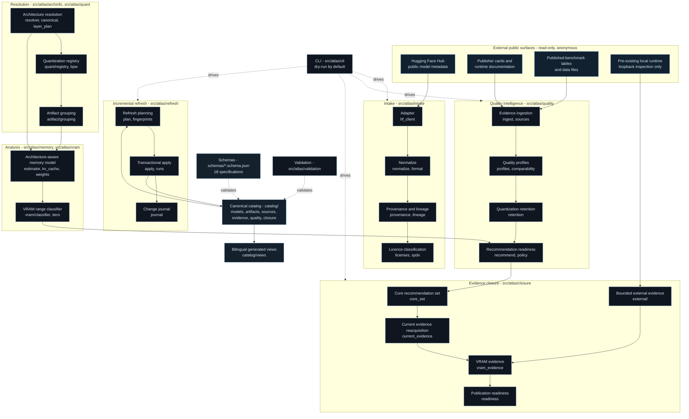

# Atlas System Architecture

> Arabic counterpart: [`docs/ar/architecture/atlas-system-architecture.md`](../../ar/architecture/atlas-system-architecture.md)
>
> Diagrams: English-labelled by design. Every figure carries a bilingual caption
> in [`docs/diagrams/README.md`](../../diagrams/README.md).

## Purpose

This document describes how the Atlas is put together: what each layer is
responsible for, what it refuses to do, and how the layers compose into a
single metadata-only pipeline.

Atlas is **metadata-only**. It reads public metadata and public documentation,
converts them into schema-validated canonical records, derives architecture-aware
memory estimates and quality-evidence state from those records, and renders
bilingual views. It never downloads model weights, never executes a model, and
never authenticates to any service.

## Figure 1 — System architecture

## Layer responsibilities

| Layer | Responsibility | What it will not do |
|---|---|---|
| External surfaces | Read public metadata and public documentation | Authenticate, upload, or download weights |
| Intake | Normalize raw metadata into canonical, provenance-carrying records | Invent a value the source did not state |
| Resolution | Recover architecture shape and quantization semantics from metadata | Guess a missing tensor dimension |
| Analysis | Produce a memory **range** with an explicit evidence state | Convert a range into a false "fits" verdict |
| Quality intelligence | Attach evaluation results to the exact artifact measured | Transfer a base model's score to a quantized derivative |
| Evidence closure | Re-acquire current provenance and decide publication readiness | Relax a gate to produce a non-zero count |
| Incremental refresh | Detect upstream change and apply it transactionally | Rewrite unchanged canonical records |
| Canonical catalog | The single source of truth, machine-readable | Depend on generated prose |
| Views | Bilingual Markdown and JSON rendered from canonical records | Be hand-edited |

## Security boundaries

The Atlas enforces two boundaries that are visible in the code rather than in a
policy document:

1. **No credentials, ever.** `src/atlas/security/metadata_fetch.py` and
   `src/atlas/intake/url_safety.py` refuse to read, store or transmit an
   authentication token. Anonymous public read is the only access mode.
2. **No weight payloads.** URLs that resolve to weight files are refused before
   a request is made, redirects are not followed, and every acquisition declares
   a request ceiling and a byte ceiling that are enforced at runtime.

Details: [`metadata-fetch-security.md`](../methodology/metadata-fetch-security.md).

## Design invariants

1. **Schemas are the contract.** Every canonical record is validated against a
   versioned JSON Schema before it can be written.
2. **The catalog is canonical; documentation is generated.** Prose never becomes
   the source of truth.
3. **Absence is a first-class value.** `unknown`, `unsupported` and
   `insufficient_evidence` are recorded states, not gaps to be filled by
   estimation.
4. **The CLI is dry-run by default.** Every mutating command requires an explicit
   `--apply`.
5. **Evidence never inherits.** A score measured on a base release does not
   transfer to a quantized derivative, and a score measured on a parent release
   does not transfer to an alignment-modified variant.
6. **A missing evidence domain lowers a state; it never raises one.**

## Module map

| Package | Concern |
|---|---|
| `atlas.intake` | Source adapters, normalization, provenance, licence classification, URL and weight guards |
| `atlas.archinfo` | Architecture resolution from `config.json` and GGUF metadata; canonical layer plan |
| `atlas.quant` | Versioned quantization registry; bits-per-weight reasoning |
| `atlas.artifact` | File grouping into artifact sets; companion-component detection |
| `atlas.memory` | Weight bytes, KV-cache bytes, static and dynamic overhead, range estimation |
| `atlas.vram` | 4 / 8 / 12 / 16 GB range classification |
| `atlas.runtimes` | Runtime knowledge base, derived from documentation only |
| `atlas.measurements` | External measurement registry; validates measurements, never produces them |
| `atlas.quality` | Evaluation ingestion, quality profiles, comparability, retention, recommendation readiness |
| `atlas.catalog` | Canonical catalog assembly, identity, qualification, tiering, view generation |
| `atlas.refresh` | Fingerprints, discovery, planning, transactional apply, change journal |
| `atlas.closure` | Core recommendation set, current-evidence reacquisition, VRAM evidence, publication readiness |
| `atlas.external` | Bounded external acquisition; loopback inspection of a pre-existing local runtime |
| `atlas.security` | Network policy enforcement |
| `atlas.validation` | Schema validation and CLI |
| `atlas.cli` | Command surface; dry-run by default |

## Further reading

- [Canonical record flow](canonical-record-flow.md)
- [Repository architecture](repository-architecture.md)
- [Data flow](data-flow.md)
- [Refresh and evidence ingestion](../../en/workflows/refresh-and-evidence-ingestion.md)
- [Recommendation readiness](../../en/workflows/recommendation-readiness.md)