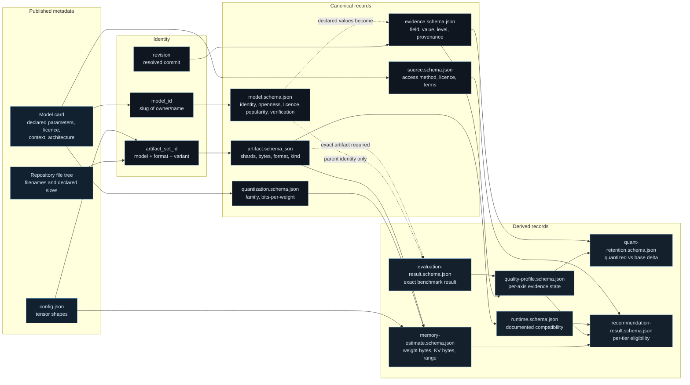

# Canonical Record Flow

> Arabic counterpart: [`docs/ar/architecture/canonical-record-flow.md`](../../ar/architecture/canonical-record-flow.md)

## Purpose

This document describes the Atlas data model: how one published model release
becomes a set of canonical, schema-validated, mutually consistent records, and
why the model is shaped the way it is.

The central design decision is that **identity is exact**. A record is about one
`artifact_set_id` at one revision — never about "a model" in the abstract. This
is what makes it possible to say "unknown" honestly instead of guessing.

## Figure 2 — Canonical record derivation

## Record families

### Primary records

| Record | Schema | Answers |
|---|---|---|
| `model` | `schemas/model.schema.json` | What is this release, who published it, under what licence, how open is it, and how well verified is each recorded field? |
| `artifact` | `schemas/artifact.schema.json` | Which concrete files constitute one quantized artifact, how many shards, what total declared bytes? |
| `source` | `schemas/source.schema.json` | How is this source accessed, under what terms, and what did we observe when we read it? |
| `evidence` | `schemas/evidence.schema.json` | One field, its value, where it came from, and at what evidence level? |

### Derived records

| Record | Schema | Answers |
|---|---|---|
| `quantization` | `schemas/quantization.schema.json` | What quantization family, and what effective bits per weight? |
| `architecture` | `schemas/architecture.schema.json` | Which architecture family, and which resolved tensor dimensions? |
| `memory-estimate` | `schemas/memory-estimate.schema.json` | What is the memory **range** under a documented calculation profile? |
| `runtime` | `schemas/runtime.schema.json` | Which runtimes are documented as compatible, and how completely? |
| `measurement` | `schemas/measurement.schema.json` | What did an external party measure, on what hardware, under what conditions? |
| `quality-profile` | `schemas/quality-profile.schema.json` | Per quality axis: is the state `known`, `partial` or `unknown`? |
| `evaluation-result` | `schemas/evaluation-result.schema.json` | One benchmark score for one exact artifact, with full harness identity? |
| `quant-retention` | `schemas/quant-retention.schema.json` | What quality delta does this quantization introduce, under a comparable harness? |
| `recommendation-result` | `schemas/recommendation-result.schema.json` | Per tier: is this artifact eligible, a candidate, or insufficient? |
| `quality-policy` | `schemas/quality-policy.schema.json` | The declared readiness policy, versioned. |

## Identity rules

1. **`model_id`** is a stable slug of the repository owner and name. It identifies
   a *release line*, not a file.
2. **`artifact_set_id`** is `model_id` plus container format plus variant label.
   Two quantizations of the same model are two different artifacts.
3. **A score attaches to an artifact, not to a model.** An evaluation result
   whose `artifact_id` is absent describes the base release only.
4. **Alignment variants are separate artifacts.** An uncensored, abliterated or
   heretic variant is catalogued independently and never inherits a score.
5. **Revision matters.** Provenance records the resolved revision, so a later
   refresh can state whether the record still describes upstream reality.

## Evidence levels

Every recorded field carries a verification status. The Atlas never promotes a
weaker status to a stronger one without a new observation.

| Status | Meaning |
|---|---|
| `unknown` | Not known, and must not be invented. |
| `unverified` | Recorded but not yet checked. |
| `estimated` | Produced under a documented method. |
| `publisher_claim` | Asserted by the model publisher; not an independent fact. |
| `quantizer_claim` | Asserted by the quantizer; not an independent fact. |
| `independently_verified` | Confirmed by an independent, reproducible source. |
| `atlas_verified` | Measured inside the Atlas under documented conditions. |

## Absent versus zero

The schemas distinguish *absent* from *zero* deliberately:

- An absent `kv_bytes` means the KV-cache requirement is **not computable** from
  available evidence. It does not mean zero.
- An absent upper memory bound means no reliable upper bound exists. The tier
  verdict is then `insufficient_evidence`, never `estimated_fit`.
- A missing quality axis means the axis is **unknown**, which lowers the profile's
  evidence status and can never raise it.

This distinction is the single most important reason the Atlas is able to report
`insufficient_evidence` instead of guessing.

## Further reading

- [System architecture](atlas-system-architecture.md)
- [Model identity methodology](../methodology/model-intake.md)
- [Provenance methodology](../methodology/provenance-methodology.md)
- [Evidence confidence methodology](../methodology/evidence-confidence-methodology.md)