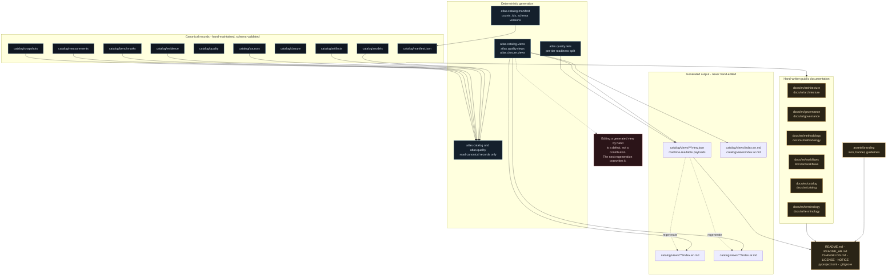

# Catalog Data Generation Workflow

> Arabic counterpart: [`docs/ar/workflows/catalog-data-generation.md`](../../ar/workflows/catalog-data-generation.md)
>
> Diagrams: English-labelled by design. Bilingual captions are collected in
> [`docs/diagrams/README.md`](../../diagrams/README.md).

## Scope

This document describes how the repository's own dataset and documentation are
produced from canonical records, and what the curated repository surface looks
like.

The governing rule is simple and absolute:

> **The canonical catalog is the source of truth. Every Markdown file and every
> JSON view is generated from it and is never hand-edited.**

## Figure 8 — From canonical records to published views



## Generated versus hand-written

| Artifact | Owner | Regenerated by |
|---|---|---|
| `catalog/views/**/index.en.md` | **generated** | `atlas catalog views`, `atlas quality views`, `atlas closure views` |
| `catalog/views/**/index.ar.md` | **generated** | same commands, from the same canonical payload |
| `catalog/views/**/view.json` | **generated** | same commands |
| `catalog/manifest.json` | **generated** | `atlas catalog manifest` |
| `catalog/quality/profiles/**` | **generated** | `atlas quality snapshot --apply` |
| `catalog/quality/retention/**` | **generated** | `atlas quality snapshot --apply` |
| `catalog/closure/readiness.json` | **generated** | `atlas closure readiness --apply` |
| `catalog/models/**`, `catalog/artifacts/**` | canonical | written by intake, one record per artifact |
| `docs/en/**`, `docs/ar/**` | hand-written | not generated; must cite canonical data |
| `README.md`, `README_AR.md` | hand-written | not generated |
| `assets/branding/**` | hand-written | not generated |

## Bilingual generation

English and Arabic views are rendered from **one canonical payload** in the same
process. This is a structural guarantee, not a review step: the two languages
cannot diverge because there is only one source for both.

The same rule governs the hand-written documentation, where a test enforces that
every English document has an Arabic counterpart with matching heading structure.

## Figure 9 — Repository information architecture

```mermaid
flowchart TB
  classDef top fill:#0F1620,stroke:#7FA8C9,color:#DCE7F1
  classDef sec fill:#14202C,stroke:#8FB8D8,color:#DCE7F1
  classDef leaf fill:#1A2836,stroke:#A8C8E0,color:#DCE7F1
  classDef guard fill:#2A2416,stroke:#E8B45A,color:#F3E3C2

  ROOT["Local LLM VRAM Atlas<br/>repository root"]

  subgraph SURFACE["Curated public surface - published"]
    ENTRY["README.md and README_AR.md<br/>language switch, honesty note,<br/>quick start, CLI examples"]
    CODE["src/atlas/**<br/>implementation, 113 modules"]
    SCH["schemas/**<br/>18 JSON Schema Draft 2020-12 specifications"]
    TST["tests/**<br/>687 offline tests, synthetic fixtures"]
    DATA["catalog/**<br/>canonical records and generated views"]
    DOCS["docs/en and docs/ar<br/>architecture, governance,<br/>methodology, workflows,<br/>catalog, terminology"]
    DIAG["docs/diagrams/README.md<br/>bilingual figure index"]
    ASSET["assets/branding/**<br/>icon, dark icon, banner,<br/>bilingual guidelines"]
    META["LICENSE - NOTICE - CHANGELOG.md<br/>pyproject.toml - .gitignore"]
    TOOLS["tools/**<br/>publication proofreading aids"]
  end

  subgraph INTERNAL["Internal engineering history - not published"]
    PHASES["docs/phases/**<br/>build-phase reports"]
    RUNS["catalog/refresh/**<br/>volatile run records"]
    CKPT["catalog/checkpoints/**<br/>discovery checkpoints"]
    JRNL["catalog/changes/**<br/>operational change journal"]
    OPS["catalog/release-candidate-data-manifest.json<br/>machine-local operational manifest"]
    HOST["catalog/closure/external/bonsai-existing-server.json<br/>owner machine observation"]
  end

  IGN[".gitignore<br/>excludes every internal path above"]

  ROOT --> ENTRY --> CODE
  ROOT --> SCH
  ROOT --> TST
  ROOT --> DATA
  ROOT --> DOCS --> DIAG
  ROOT --> ASSET
  ROOT --> META
  ROOT --> TOOLS

  IGN -.-> PHASES
  IGN -.-> RUNS
  IGN -.-> CKPT
  IGN -.-> JRNL
  IGN -.-> OPS
  IGN -.-> HOST

  class ROOT,ENTRY,META top
  class CODE,SCH,TST,DATA,DOCS sec
  class DIAG,ASSET,TOOLS,ENTRY leaf
  class IGN guard
```



## What is deliberately absent from the published tree

The internal engineering history is not an oversight. It is excluded by design:

| Excluded | Reason |
|---|---|
| `docs/phases/**` | Build-phase execution reports, closure reports and handoff inventories. Not public documentation. |
| `catalog/refresh/**` | Volatile run records; regenerated on demand. |
| `catalog/checkpoints/**` | Internal discovery scratch state. |
| `catalog/changes/**` | Operational change journal; regenerable, and noisy as history. |
| `catalog/release-candidate-data-manifest.json` | Operational manifest carrying a machine-local absolute path. |
| `catalog/closure/external/bonsai-existing-server.json` | Observation of the owner's own machine, including a process id and port. |

None of these paths is required to read, validate, or regenerate the published
dataset.

## Regenerating the dataset

```bash
python -m atlas.cli.main catalog views            # tier and axis views
python -m atlas.cli.main quality snapshot         # profiles, retention, gaps, manifest
python -m atlas.cli.main quality views            # quality views in EN and AR
python -m atlas.cli.main closure views            # closure views in EN and AR
python -m atlas.cli.main catalog stats            # counts by format and quant family
```

Every generation command is dry-run by default; add `--apply` to write.

## Further reading

- [Catalog overview](../catalog/catalog-overview.md)
- [Repository architecture](../architecture/repository-architecture.md)
- [Generated documentation policy](../methodology/generated-documentation-policy.md)
- [Catalog views methodology](../methodology/catalog-views.md)