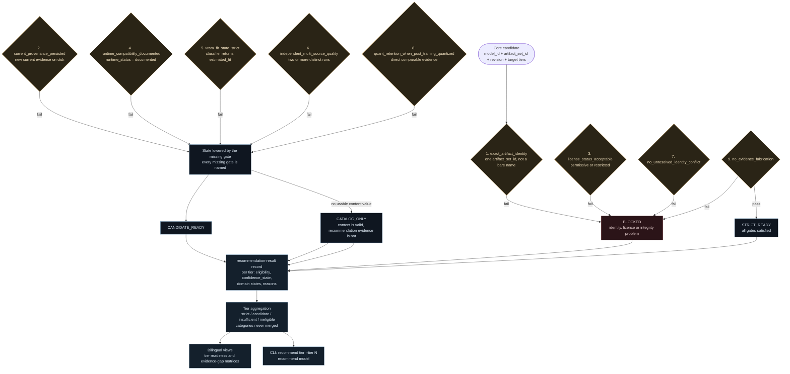

# Recommendation Readiness Workflow

> Arabic counterpart: [`docs/ar/workflows/recommendation-readiness.md`](../../ar/workflows/recommendation-readiness.md)
>
> Diagrams: English-labelled by design. Bilingual captions are collected in
> [`docs/diagrams/README.md`](../../diagrams/README.md).

## Scope

This document explains how a candidate artifact becomes — or fails to become — a
recommendation for a given VRAM tier, and how the repository reports that
outcome honestly.

## What "readiness" means

The Atlas does not publish a ranked list of "best models". It publishes a
**readiness state** for each candidate at each tier, derived from declared gates.
The state is categorical, and the categories are never merged.

| State | Meaning |
|---|---|
| `STRICT_READY` | Every declared strict gate is satisfied by persisted, walkable evidence. |
| `CANDIDATE_READY` | Substantial evidence, useful content, one or more strict gates still open, and every missing gate named. |
| `CATALOG_ONLY` | Legitimate catalog content without enough recommendation evidence. |
| `BLOCKED` | A critical identity, licence, runtime, lineage or evidence-integrity problem. |

## Figure 7 — Recommendation decision flow



## Gate semantics

| Gate | Failure effect | Why it exists |
|---|---|---|
| `exact_artifact_identity` | `BLOCKED` | A score or size attached to "a model" cannot be attributed to a specific file. |
| `current_provenance_persisted` | state lowered | A record that no longer describes upstream must not be published as current. |
| `license_status_acceptable` | `BLOCKED` | An unclear or unacceptable licence is a governance problem, not an evidence gap. |
| `runtime_compatibility_documented` | state lowered | An artifact nobody has documented running is not a recommendation. |
| `vram_fit_state_strict` | state lowered | Without a reliable bound, "fits" is a guess. |
| `independent_multi_source_quality` | state lowered | One publisher table is not an independent quality assessment. |
| `no_unresolved_identity_conflict` | `BLOCKED` | A contradictory identity makes every derived number untrustworthy. |
| `quant_retention_when_post_training_quantized` | state lowered | Quantization can cost quality; that cost must be measured, not assumed. |
| `no_evidence_fabrication` | `BLOCKED` | The one gate that can never be waived. |

**A single missing gate lowers a state. It never raises one.**

## Hard rules

1. No policy threshold, classifier state or source-class rule is relaxed to
   produce a non-zero count.
2. No manual override exists, and there is no waiver by popularity, brand,
   recency, size or parameter count.
3. States are never merged, never waived and never set by hand.
4. Zero strict recommendations is a valid, publishable outcome.
5. Where a strict recommendation is absent, the repository says so and names the
   blocking gate.

## Signals that can never raise a state

```
downloads · likes · trending · parameter_count · artifact_byte_size
publisher_brand · release_recency · adoption
```

Popularity is recorded as a popularity signal and nothing else. It is never
converted into a quality benchmark, and it never contributes to eligibility.

## Current reported position

The repository reports **zero `STRICT_READY` candidates at 4, 8, 12 and 16 GB**.
The dominant blocking gates are `independent_multi_source_quality` and
`vram_fit_state_strict`, followed by
`quant_retention_when_post_training_quantized`.

This is not an unfinished state that a later release will quietly correct. It is
the current, evidence-backed answer, and the Atlas prefers it to a fabricated
non-zero count. Regenerate the live figures with:

```bash
python -m atlas.cli.main recommend tier --tier 8
python -m atlas.cli.main closure readiness
```

## Further reading

- [Recommendation eligibility methodology](../methodology/recommendation-eligibility-methodology.md)
- [Evidence closure methodology](../methodology/evidence-closure-methodology.md)
- [Evidence gaps methodology](../methodology/evidence-gaps-methodology.md)
- [Quality profiles methodology](../methodology/quality-profiles-methodology.md)
- [Publication readiness data policy](../methodology/publication-readiness-data-policy.md)