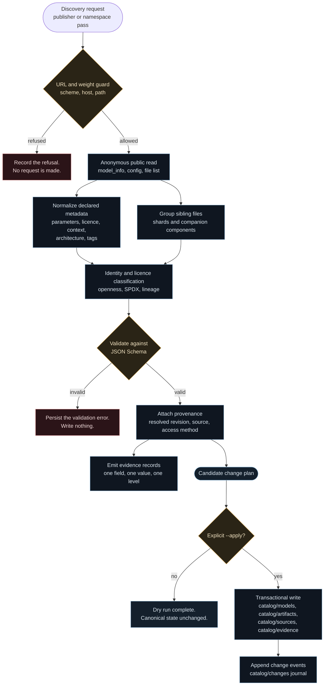
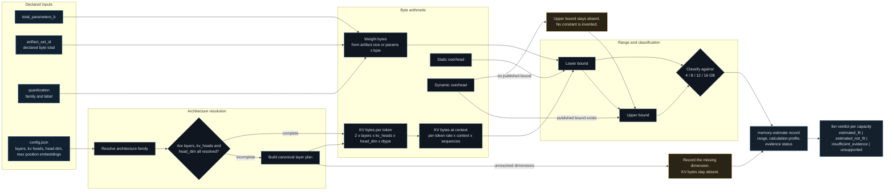
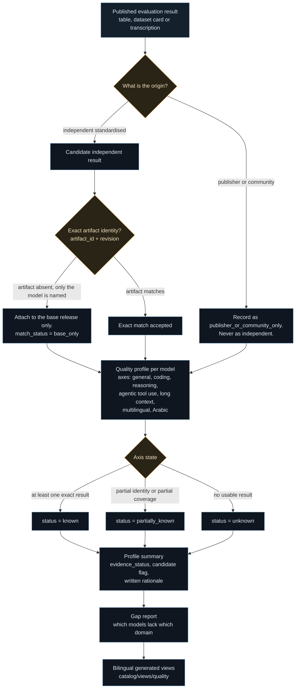
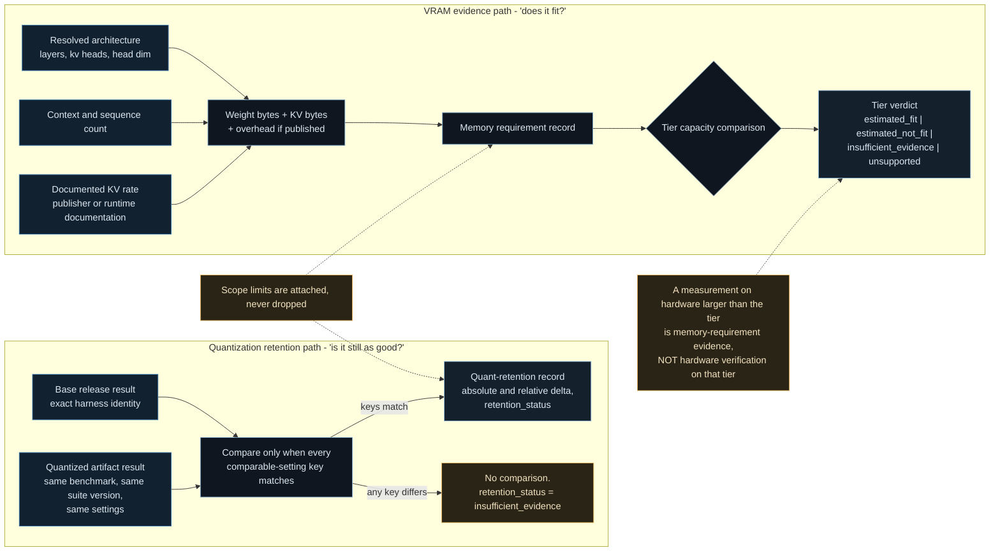

# Refresh and Evidence Ingestion Workflows

> Arabic counterpart: [`docs/ar/workflows/refresh-and-evidence-ingestion.md`](../../ar/workflows/refresh-and-evidence-ingestion.md)
>
> Diagrams: English-labelled by design. Bilingual captions are collected in
> [`docs/diagrams/README.md`](../../diagrams/README.md).

## Scope

This document covers the workflows that bring external reality into the Atlas:

1. **Source discovery and controlled intake**
2. **Architecture, memory and quantization analysis**
3. **Quality evidence ingestion**
4. **Retention and VRAM evidence flow**

Every workflow in this document is **bounded, anonymous, read-only with respect
to upstream**, and **dry-run by default** with respect to the local catalog.

---

## Workflow A — Source discovery and controlled intake

### Figure 3 — Discovery to canonical record



### Rules

- A refused URL produces a **recorded refusal**, not an exception and not a
  silent skip. The absence of a refusal record would make a bounded search
  indistinguishable from an unfinished one.
- No credentials are read, stored or transmitted at any point.
- Weight-payload URLs are refused **before** a network request is made.
- Redirects are not followed.
- The canonical catalog is never modified without an explicit `--apply`.

---

## Workflow B — Architecture, memory and quantization analysis

### Figure 4 — From declared metadata to a memory range



### Rules

- **A range is not a verdict.** The classifier consumes a range plus an evidence
  state, and emits a tier verdict that may legitimately be
  `insufficient_evidence`.
- **A missing dimension stays missing.** If `num_key_value_heads` is unresolved,
  KV bytes are absent, not zero.
- **No invented overhead constant.** If the runtime publishes no static or
  dynamic GPU-memory overhead bound, the upper bound stays absent and no number
  is substituted. This single rule is why the Atlas currently reports zero
  strict tier fits, and it is a deliberate outcome rather than a gap to be
  papered over.
- **File size is not VRAM usage.** Weight bytes are one term in the range, not
  the answer.

---

## Workflow C — Quality evidence ingestion

### Figure 5 — From a published result to a quality axis



### Rules

- **The base release's score is never transferred to a quantized derivative.** A
  post-training-quantized artifact with no exact result is `unevaluated`, not
  "approximately as good as the base".
- **An alignment-modified variant never inherits its parent's score.**
- **Publisher evidence is recorded, and labelled as publisher evidence.** It can
  never satisfy the independent-multi-source gate.
- **A multilingual claim is not Arabic evidence.** The Arabic quality axis stays
  `unknown` until an Arabic-specific result exists. See
  [`quality-evidence-methodology.md`](../methodology/quality-evidence-methodology.md).
- **Independence is counted per run**, keyed on evaluator, benchmark, benchmark
  version, suite version, evaluation date and metric, so that two pages
  republishing one run cannot manufacture multi-source status.

---

## Workflow D — Retention and VRAM evidence flow

### Figure 6 — Two evidence paths that must not be confused



### Rules

- **Retention and fit are different questions.** Retention asks whether
  quantization degraded quality. Fit asks whether the artifact runs on a given
  capacity. Neither answer implies the other.
- **Comparability is all-or-nothing.** If any comparable-setting key differs, no
  delta is computed and the record says so.
- **A scope limit travels with the record.** A measurement taken at a
  100 000-token context is not a baseline-context fit measurement, and the record
  says exactly that.
- **Hardware is not substituted for capacity.** A measurement taken on hardware
  larger than the target tier is evidence about memory requirements, not
  verification that the artifact runs on the smaller tier.

---

## Running these workflows

Every workflow above is exposed through one CLI, dry-run by default:

```bash
python -m atlas.cli.main discover candidates          # controlled discovery passes
python -m atlas.cli.main discover delta              # bounded incremental discovery
python -m atlas.cli.main refresh plan                # dry-run plan
python -m atlas.cli.main refresh status              # checkpoints, queue, journal
python -m atlas.cli.main refresh apply --plan <file> # transactional apply
python -m atlas.cli.main quality sources --check     # quality source registry
python -m atlas.cli.main quality gaps                # missing evidence domains
python -m atlas.cli.main retention show <model_id>   # quantization retention
python -m atlas.cli.main closure evidence            # current provenance reacquisition
python -m atlas.cli.main closure vram                # tier fit states
python -m atlas.cli.main closure readiness           # publication readiness
```

### Exit-code contract

The refresh surface uses a documented exit-code contract so a caller can
distinguish "nothing to do" from "something needs a human".

| Code | Meaning |
|---|---|
| `0` | Success: no changes, or informational only. |
| `10` | Changes found: the plan contains operations. **This is the expected result of a successful planning run, not an error.** |
| `11` | Review required: critical or high-impact changes are pending. |
| `12` | Partial run: request budget exhausted, state persisted. |
| `13` | External source failure; checkpoints preserved. |
| `14` | Stale plan refused: the catalog moved since the plan was built. |
| `15` | Transaction failure; the change was rolled back. |
| `16` | Recovery required: an incomplete transaction marker was found. |
| `17` | Security block: unsafe URL, weight payload or authentication attempt. |
| `18` | Invalid input: bad arguments, schema failure or unreadable plan file. |

Because `10` is a success signal, scripts should test for `0` **or** `10` when
they only need to know that planning succeeded.

## Further reading

- [Transactional refresh methodology](../methodology/transactional-refresh.md)
- [Refresh planning](../methodology/refresh-planning.md)
- [Quantization retention methodology](../methodology/quantization-retention-methodology.md)
- [VRAM methodology](../methodology/vram-methodology.md)
- [Benchmark comparability methodology](../methodology/benchmark-comparability-methodology.md)
- [Metadata fetch security](../methodology/metadata-fetch-security.md)